# Praktikum 1: PHP Framework (Codeigniter)

`Nama  : Faizah Via Fadhillah`

`Nim   : 312210460`

`Kelas : TI22.A4`

## Langkah-langkah Praktikum

1. Persiapan
   Sebelum memulai menggunakan Framework Codeigniter, perlu dilakukan konfigurasi pada webserver. Beberapa ekstensi PHP perlu diaktifkan untuk kebutuhan pengembangan Codeigniter 4
   Berikut beberapa ekstensi yang perlu diaktifkan:

   - php-json ekstension untuk bekerja dengan JSON;
   - php-mysqlnd native driver untuk MySQL;
   - php-xml ekstension untuk bekerja dengan XML;
   - php-intl ekstensi untuk membuat aplikasi multibahasa;
   - libcurl (opsional), jika ingin pakai Curl.

Untuk mengaktifkan ekstentsi tersebut, melalu XAMPP Control Panel, pada bagian Apache klik Config -> PHP.in

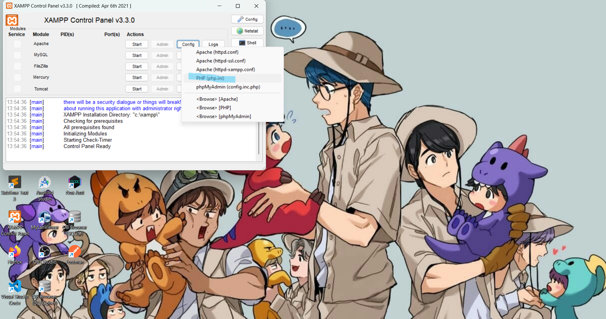

2. Pada bagian extention, hilangkan tanda ; (titik koma) pada ekstensi yang akan diaktifkan. Kemudian simpan kembali filenya dan restart Apache web server

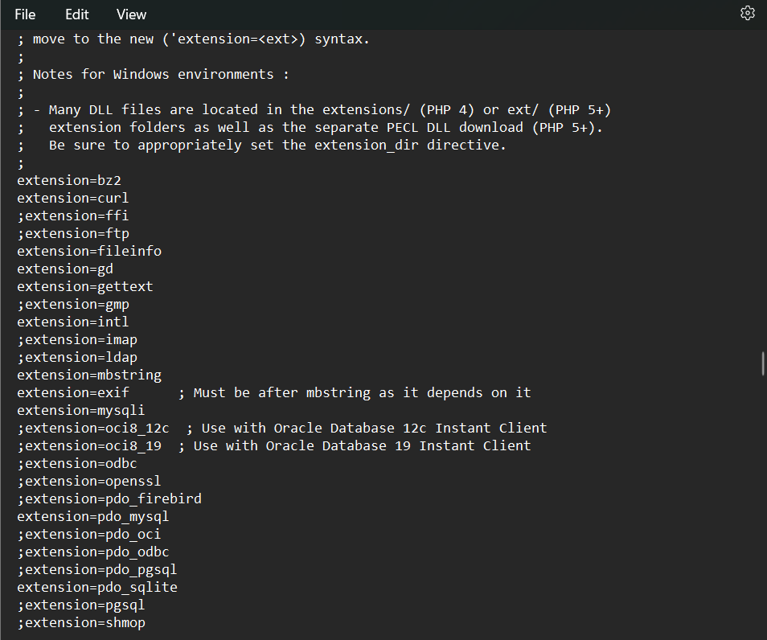

## Instalasi Codeigniter 4

Untuk melakukan instalasi Codeigniter 4 dapat dilakukan dengan dua cara, yaitu cara manual dan menggunakan composer. Pada praktikum ini kita menggunakan cara manual.

- Unduh Codeigniter dari website https://codeigniter.com/download
- Extrak file zip Codeigniter ke direktori htdocs/lab11_ci.
- Ubah nama direktory framework-4.x.xx menjadi ci4.
- Buka browser dengan alamat http://localhost/lab11_ci/ci4/public/

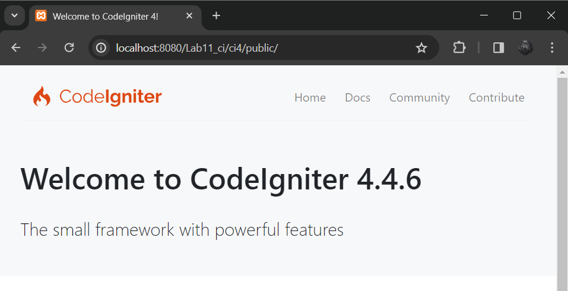

## Menjalankan CLI (Command Line Interface)

1. Codeigniter 4 menyediakan CLI untuk mempermudah proses development. Untuk mengakses CLI buka terminal/command prompt.

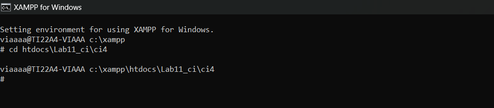

2. Arahkan lokasi direktori sesuai dengan direktori kerja project dibuat (xampp/htdocs/lab11_ci/ci4/) Perintah yang dapat dijalankan untuk memanggil CLI Codeigniter adalah:

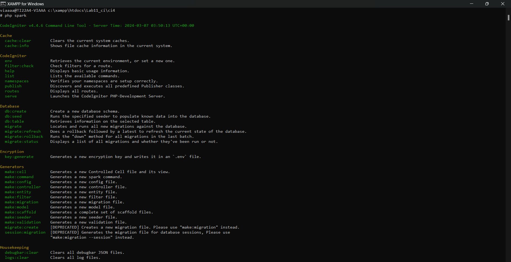

## Mengaktifkan Mode Debugging

1. Codeigniter 4 menyediakan fitur debugging untuk memudahkan developer untuk mengetahui pesan error apabila terjadi kesalahan dalam membuat kode program. Secara default fitur ini belum aktif. Ketika terjadi error pada aplikasi akan ditampilkan pesan kesalahan seperti berikut:

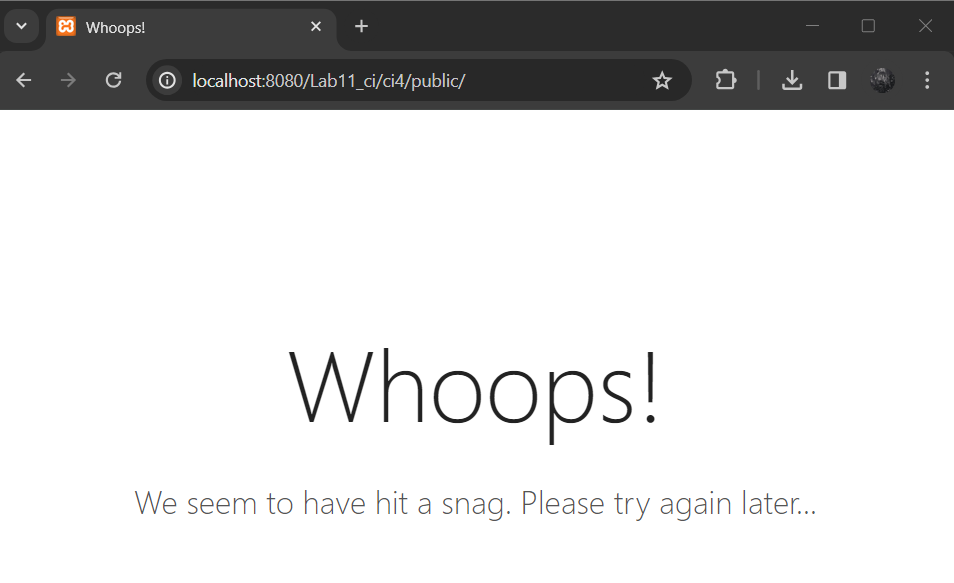

2. Semua jenis error akan ditampilkan sama. Untuk memudahkan mengetahui jenis errornya, maka perlu diaktifkan mode debugging dengan mengubah nilai konfigurasi pada environment variable `CI_ENVIRINMENT` menjadi `development`.

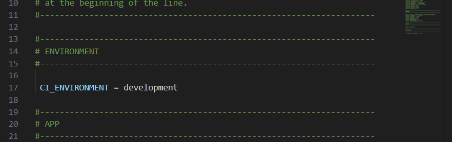

Ubah nama file `env` menjadi `.env` kemudian buka file tersebut dan ubah nilai variable
CI_ENVIRINMENT menjadi development.

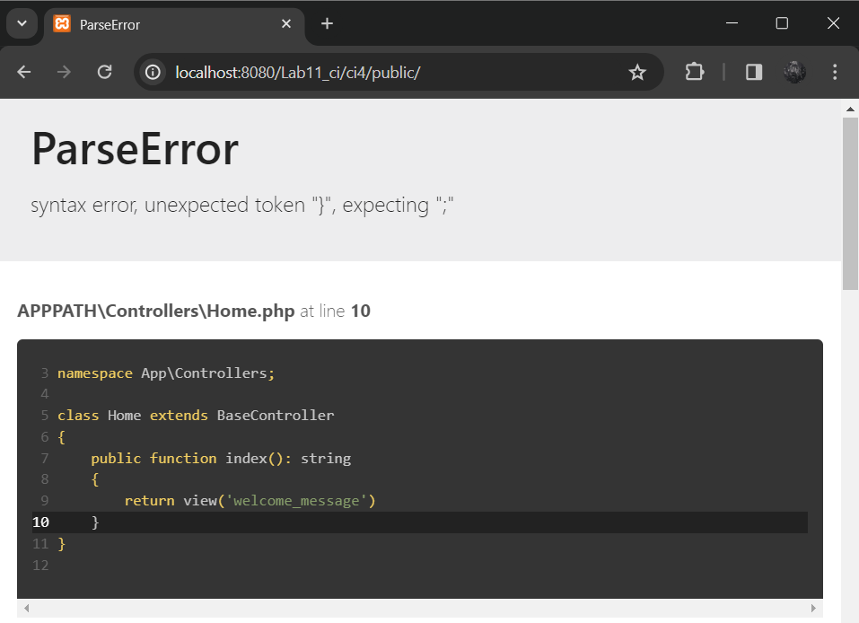

Contoh error yang terjadi. Untuk mencoba error tersebut, ubah kode pada file
app/Controller/Home.php hilangkan titik koma pada akhir kode

## Routing dan Controller

Routing merupakan proses yang mengatur arah atau rute dari request untuk menentukan fungsi/bagian mana yang akan memproses request tersebut. Pada framework CI4, routing bertujuan untuk menentukan Controller mana yang harus merespon sebuah request. Controller adalah class atau script yang bertanggung jawab merespon sebuah request. Pada Codeigniter, request yang diterima oleh file index.php akan diarahkan ke Router untuk meudian oleh router tesebut diarahkan ke Controller.

Router terletak pada file app/config/Routes.php

1. Pada file tersebut kita dapat mendefinisikan route untuk aplikasi yang kita buat.

```php
$routes->get('/', 'Home::index');
```

Kode tersebut akan mengarahkan rute untuk halaman home.

2. Tambahkan kode berikut di dalam Routes.php

```php
$routes->get('/about', 'Page::about');
$routes->get('/contact', 'Page::contact');
$routes->get('/faqs', 'Page::faqs');
```

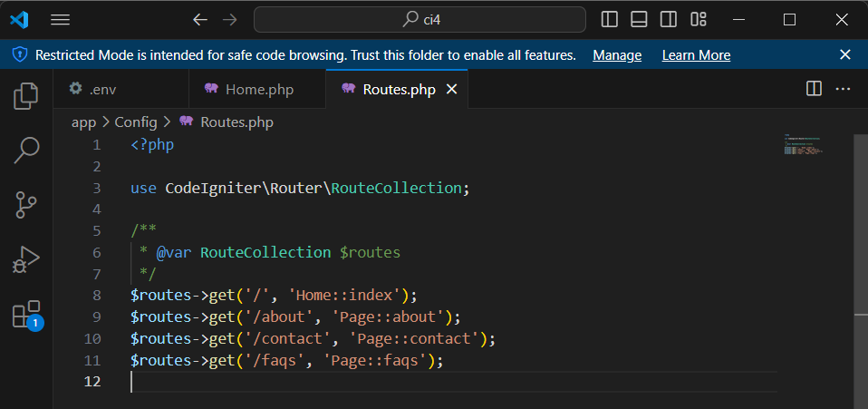

3. Untuk mengetahui route yang ditambahkan sudah benar, buka CLI dan jalankan perintah
   berikut
   `php spark routes`

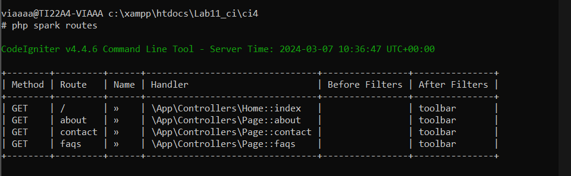

4. Selanjutnya coba akses route yang telah dibuat dengan mengakses alamat url

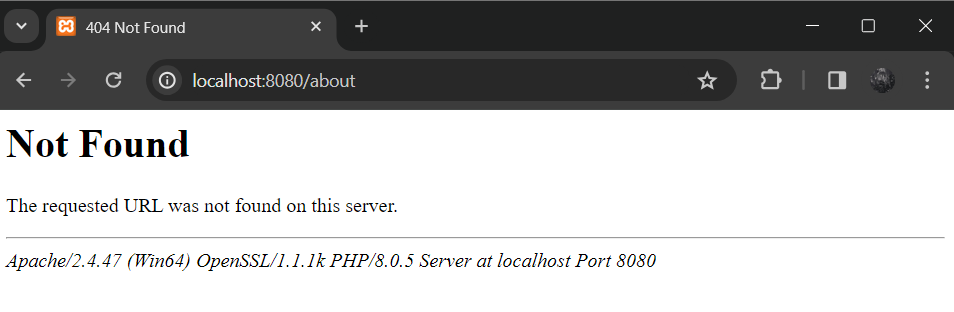

Ketika diakses akan mucul tampilan error 404 file not found, itu artinya file/page tersebut tida ada. Untuk dapat mengakses halaman tersebut, harus dibuat terlebih dahulu Contoller yang sesuai dengan routing yang dibuat yaitu Contoller Page

## Membuat Controller

1. Selanjutnya adalah membuat Controller Page. Buat file baru dengan nama page.php pada direktori Controller kemudian isi kodenya seperti berikut.

```php
<?php
namespace App\Controllers;
class Page extends BaseController
{
    public function about()
    {
        echo "Ini halaman About";
    }
    public function contact()
    {
        echo "Ini halaman Contact";
    }
    public function faqs()
    {
        echo "Ini halaman FAQ";
    }
}
```

2. Selanjutnya refresh Kembali browser, maka akan ditampilkan hasilnya yaitu halaman sudah dapat diakses.

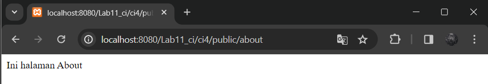

## Auto Routing

1. Secara default fitur autoroute pada Codeiginiter sudah aktif. Untuk mengubah status autoroute dapat mengubah nilai variabelnya. Untuk menonaktifkan ubah nilai true menjadi false.

`$routes->setAutoRoute(true);`

2. Tambahkan method baru pada Controller Page seperti berikut.

```php
public function tos()
{
echo "ini halaman Term of Services";
}
```

Method ini belum ada pada routing, sehingga cara mengaksesnya dengan menggunakan
alamat: http://localhost:8080/page/tos

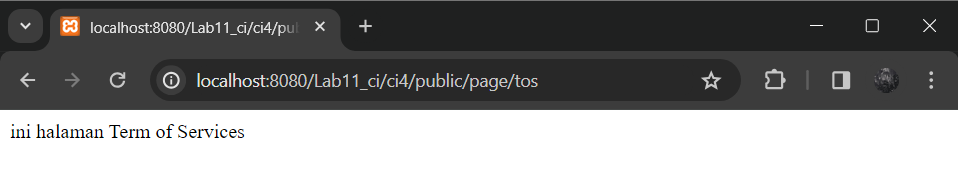

## Membuat View

1. Selanjutnya adalam membuat view untuk tampilan web agar lebih menarik. Buat file baru dengan nama about.php pada direktori view (app/view/about.php) kemudian isi kodenya seperti berikut:

```html
<!DOCTYPE html>
<html lang="en">
  <head>
    <meta charset="UTF-8" />
    <meta http-equiv="X-UA-Compatible" content="IE=edge" />
    <meta name="viewport" content="width=device-width, initial-scale=1.0" />
    <title><?= $title; ?></title>
  </head>
  <body>
    <h1><?= $title; ?></h1>
    <hr />
    <p><?= $content; ?></p>
  </body>
</html>
```

2. Ubah method about pada class Controller Page menjadi seperti berikut:

```php
public function about(){
    return view('about', [
        'title' => 'Halaman About',
        'content' => 'Ini adalah Halaman About yang menjelaskan tentang isi halaman, dibuat melalui Views'
    ]);
}
```

3. Kemudian lakukan refresh pada halaman tersebut.

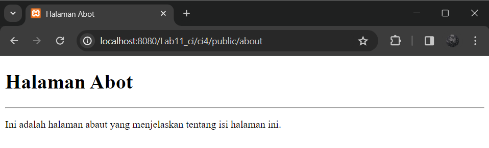

## Membuat Layout Web dengan CSS

Pada dasarnya layout web dengan css dapat diimplamentasikan dengan mudah pada codeigniter. Yang perlu diketahui adalah, pada Codeigniter 4 file yang menyimpan asset css dan javascript terletak pada direktori public.

1.  Buat file css pada direktori public dengan nama style.css copy file dari praktikum lab4_layout. Kita akan gunakan layout yang pernah dibuat pada praktikum 4.

2.  Kemudian buat folder template pada direktori view kemudian buat file `header.php` dan `footer.php`

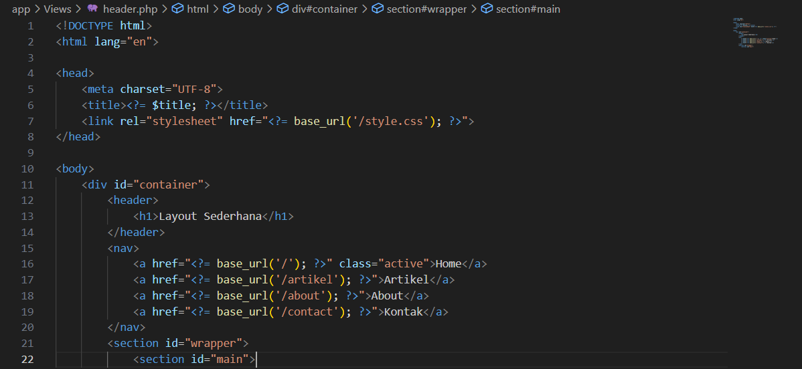

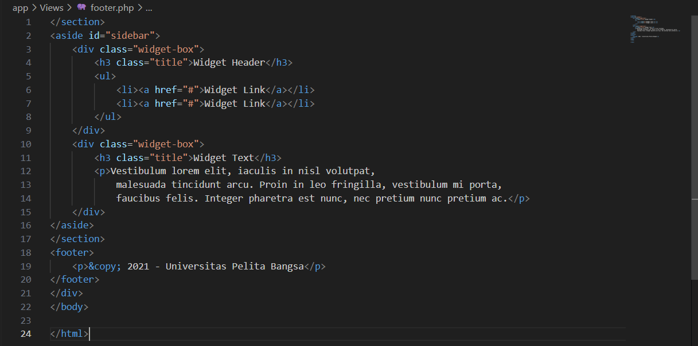

3. Kemudian ubah file app/view/about.php seperti berikut

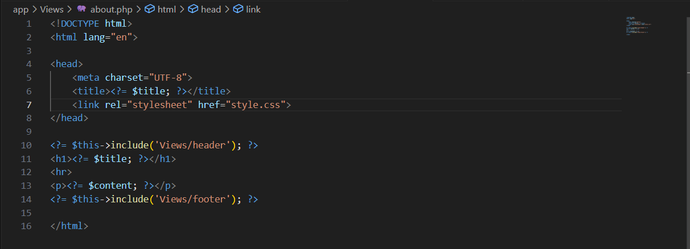

### Output Final Tampilan Website

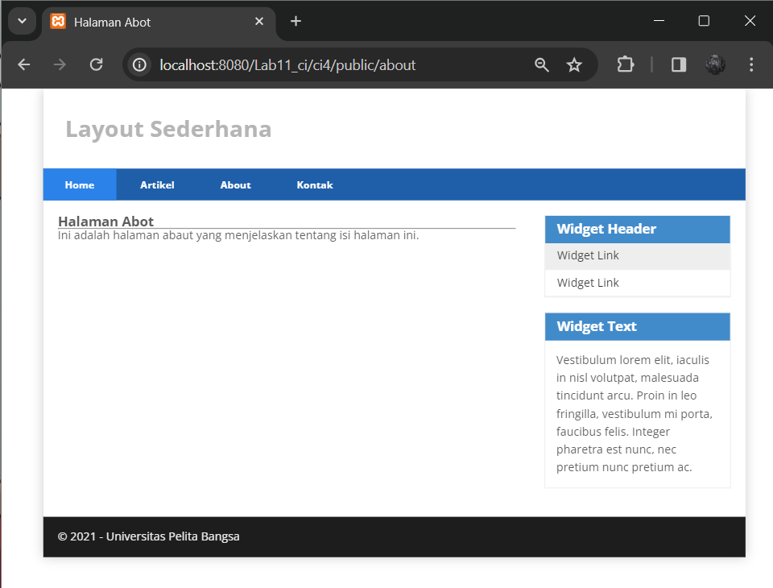
